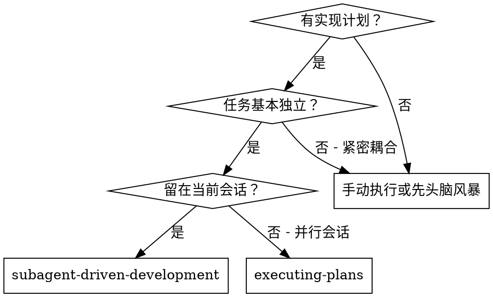
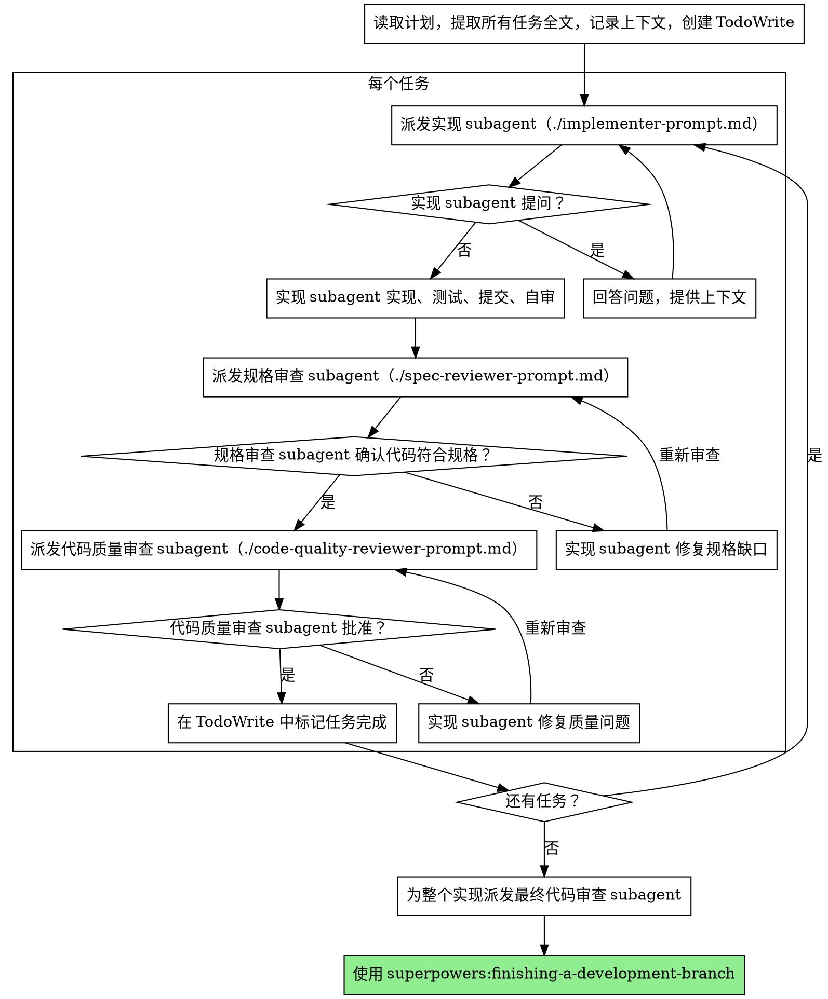

# Subagent 驱动开发

通过为每个任务派发全新的 subagent 来执行计划，并在每个任务完成后进行两阶段审查：先做规格符合性审查，再做代码质量审查。

**为什么使用 subagent：** 你把任务委派给拥有隔离上下文的专门 agent。通过精确编写它们的指令和上下文，可以确保它们保持专注并完成任务。它们绝不应该继承你当前会话的上下文或历史；你只构造它们完成任务所需的内容。这也能保留你自己的上下文，用于协调工作。

**核心原则：** 每个任务使用全新 subagent + 两阶段审查（先规格，后质量）= 高质量、快速迭代。

**连续执行：** 不要在任务之间暂停向人类伙伴确认。按计划执行所有任务，不要中途停下。只有三种停止理由：你无法解决的 BLOCKED 状态、确实阻止进展的歧义，或所有任务已完成。“我应该继续吗？”这类提示和进度摘要会浪费他们的时间；他们让你执行计划，就执行计划。

## 使用时机



**对比 Executing Plans（并行会话）：**

- 同一会话（没有上下文切换）
- 每个任务使用全新 subagent（没有上下文污染）
- 每个任务后进行两阶段审查：先规格符合性，再代码质量
- 更快迭代（任务之间不需要人工介入）

## 流程



## 模型选择

使用能够胜任每个角色的最低能力模型，以节省成本并提高速度。

**机械性实现任务**（隔离函数、清晰规格、1-2 个文件）：使用快速、便宜的模型。计划写得足够明确时，大多数实现任务都是机械性的。

**集成和判断任务**（多文件协调、模式匹配、调试）：使用标准模型。

**架构、设计和审查任务：** 使用可用的最强模型。

**任务复杂度信号：**

- 只触及 1-2 个文件且规格完整 -> 便宜模型
- 触及多个文件且有集成问题 -> 标准模型
- 需要设计判断或广泛理解代码库 -> 最强模型

## 处理实现者状态

实现 subagent 会报告四种状态之一。按下面方式处理：

**DONE：** 进入规格符合性审查。

**DONE_WITH_CONCERNS：** 实现者完成了工作，但提出疑虑。继续前先阅读这些疑虑。如果疑虑涉及正确性或范围，先处理再进入审查。如果只是观察（例如“这个文件变得很大”），记录后继续审查。

**NEEDS_CONTEXT：** 实现者需要未提供的信息。补充缺失上下文并重新派发。

**BLOCKED：** 实现者无法完成任务。评估阻塞点：

1. 如果是上下文问题，提供更多上下文并用同一模型重新派发
2. 如果任务需要更多推理，使用更强模型重新派发
3. 如果任务太大，拆成更小的部分
4. 如果计划本身有错，升级给人类

**绝不要** 忽略升级，也不要在没有任何变化的情况下强迫同一模型重试。如果实现者说卡住了，必须改变某些条件。

## Prompt 模板

- `./implementer-prompt.md` - 派发实现 subagent
- `./spec-reviewer-prompt.md` - 派发规格符合性审查 subagent
- `./code-quality-reviewer-prompt.md` - 派发代码质量审查 subagent

## 示例流程

```text
你：我正在使用 Subagent 驱动开发来执行这个计划。

[读取计划文件一次：docs/superpowers/plans/feature-plan.md]
[提取全部 5 个任务的全文和上下文]
[创建包含所有任务的 TodoWrite]

任务 1：Hook 安装脚本

[获取任务 1 文本和上下文（已提前提取）]
[使用完整任务文本 + 上下文派发实现 subagent]

实现者：“开始前我想确认一下，hook 应该安装在用户级还是系统级？”

你：“用户级（~/.config/superpowers/hooks/）”

实现者：“明白。现在开始实现……”
[稍后] 实现者：
  - 实现了 install-hook 命令
  - 添加测试，5/5 通过
  - 自审：发现漏了 --force 标志，已补上
  - 已提交

[派发规格符合性审查]
规格审查者：✅ 符合规格 - 所有要求已满足，没有额外内容

[获取 git SHA，派发代码质量审查]
代码审查者：优点：测试覆盖好，代码干净。问题：无。批准。

[标记任务 1 完成]

任务 2：恢复模式

[获取任务 2 文本和上下文（已提前提取）]
[使用完整任务文本 + 上下文派发实现 subagent]

实现者：[没有问题，直接继续]
实现者：
  - 添加 verify/repair 模式
  - 8/8 测试通过
  - 自审：一切正常
  - 已提交

[派发规格符合性审查]
规格审查者：❌ 发现问题：
  - 缺失：进度报告（规格要求“每 100 个条目报告一次”）
  - 多余：添加了 --json 标志（未要求）

[实现者修复问题]
实现者：移除了 --json 标志，添加了进度报告

[规格审查者再次审查]
规格审查者：✅ 现在符合规格

[派发代码质量审查]
代码审查者：优点：扎实。问题（重要）：魔法数字（100）

[实现者修复]
实现者：提取 PROGRESS_INTERVAL 常量

[代码审查者再次审查]
代码审查者：✅ 批准

[标记任务 2 完成]

...

[所有任务完成后]
[派发最终代码审查者]
最终审查者：所有要求已满足，可以合并

完成！
```

## 优势

**对比手动执行：**

- Subagent 会自然遵循 TDD
- 每个任务都是全新上下文（不会混乱）
- 并行安全（subagent 不互相干扰）
- Subagent 可以提问（工作前和工作中都可以）

**对比 Executing Plans：**

- 同一会话（无需交接）
- 持续推进（无需等待）
- 自动审查关卡

**效率收益：**

- 没有文件读取开销（控制者提供完整文本）
- 控制者精确筛选所需上下文
- Subagent 从一开始就获得完整信息
- 问题在开始工作前暴露（而不是之后）

**质量关卡：**

- 自审在交接前发现问题
- 两阶段审查：规格符合性，然后代码质量
- 审查循环确保修复真的有效
- 规格符合性防止多做或少做
- 代码质量确保实现足够稳

**成本：**

- 更多 subagent 调用（每个任务：实现者 + 2 个审查者）
- 控制者需要更多准备工作（提前提取所有任务）
- 审查循环会增加迭代次数
- 但能更早发现问题（比之后调试更便宜）

## 红旗

**绝不要：**

- 未经用户明确同意就在 main/master 分支上开始实现
- 跳过审查（规格符合性或代码质量）
- 带着未修复问题继续推进
- 并行派发多个实现 subagent（会冲突）
- 让 subagent 自己读计划文件（直接提供完整文本）
- 跳过场景上下文（subagent 需要理解任务处在什么位置）
- 忽略 subagent 的问题（先回答，再让它继续）
- 在规格符合性上接受“差不多”（规格审查者发现问题 = 未完成）
- 跳过复审循环（审查者发现问题 = 实现者修复 = 再审查）
- 让实现者自审替代真正审查（两者都需要）
- **在规格符合性审查 ✅ 前开始代码质量审查**（顺序错误）
- 任一审查仍有未解决问题时进入下一个任务

**如果 subagent 提问：**

- 清楚、完整地回答
- 必要时提供额外上下文
- 不要催它进入实现

**如果审查者发现问题：**

- 由实现者（同一个 subagent）修复
- 审查者再次审查
- 重复直到批准
- 不要跳过复审

**如果 subagent 任务失败：**

- 用具体指令派发修复 subagent
- 不要手动修复（会污染上下文）

## 集成

**必需的工作流技能：**

- **superpowers:using-git-worktrees** - 确保隔离工作区（创建一个，或确认已有）
- **superpowers:writing-plans** - 创建此技能要执行的计划
- **superpowers:requesting-code-review** - 审查 subagent 使用的代码审查模板
- **superpowers:finishing-a-development-branch** - 所有任务完成后收尾开发

**Subagent 应使用：**

- **superpowers:test-driven-development** - Subagent 为每个任务遵循 TDD

**替代工作流：**

- **superpowers:executing-plans** - 用于并行会话，而不是同会话执行
